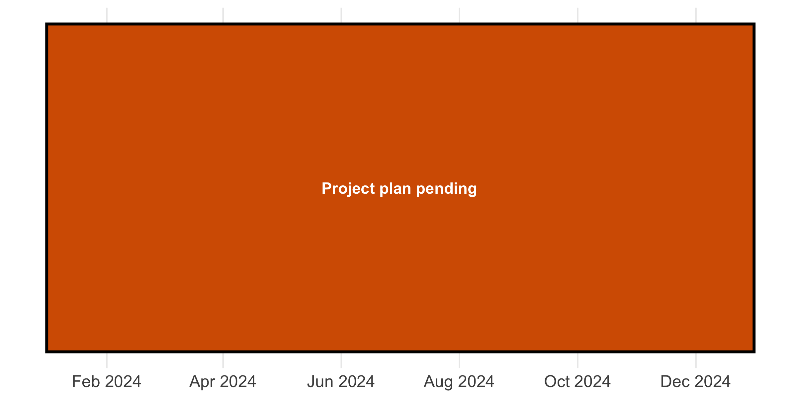

README
================
Cornelius Hennch
21.02.2024

# PreTHOD: Prediction of Therapy Outcome in Depression

Cornelius Hennch, last updated: 21.02.2024

**R-Version:** R version 4.3.1 (2023-06-16)

**RStudio-Version:** 2023.6.1.524

<!-- ## Table of contents -->
<!-- -   [Project summary](#Project-summary) -->
<!-- -   [Project plan and current status](#project-plan-and-current-status) -->

## Project summary

PreTHOD is a data analysis project at the [St. Hedwig university
hospital of the Charité - Universitätsmedizin
Berlin](https://psychiatrie-psychotherapie.charite.de/fuer_patienten/charite_im_shk/ "Link to hospital web-site")
that tries to identify prognostic factors for the treatment outcome of
depression by analyzing a dataset from routine clinical practice. The
data were collected with tablet-based standardized self-rating tools
both in the day clinic as well as the specialized ward for depression.
Both settings work with the same cognitive-behavioral therapy program
that consists of group and single therapeutic sessions as well as
complementary therapies.

## Project plan and current status

[**Project plan and timeline**](#project-plan-and-timeline)

- Timeline and goals → ✅
- Detailed project plan → 🚧
- Team responsibilities
  - C. Hennch (lead author) 🧑‍🔬
  - H. Stuke (methodological support) 👨‍💻
  - N. Schoofs (supervisor) 👩‍⚕️
  - *K.Priebe (data)* ❓
- *Regular team meetings → ❓*

[**Preregistration and Registered
Reports**](#preregistration-and-registered-reports)

- Preregistration → 🚧
- Registered reports → **journals** ❓

[**Data and Code Management**](#data-and-code-management)

- Clean, well-documented code → Code written according to Hadley
  Wickhams [tidyverse style guide](https://style.tidyverse.org) ✅
- Version control tools (e.g., Git) → This repository on github. ✅
- README file → 🚧
- Acquisition, storage, and sharing → PEQ, sharing after publication ✅
- Data and code management plan → clear repository structure 🚧
- Ethical and legal requirements → Written informed consent available
  :white_check_mark:

[**Statistical Analysis**](#statistical-analysis)

- Plan statistical analysis
- Reporting guidelines
- Handling of Missing data

[**Publication and Dissemination**](#publication-and-dissemination)

- Literature review
- Manuscript writing
- Open access journal ❓
- Sharing data and code

## Project plan and timeline

First draft for timeline:

<!-- -->

## Preregistration and Registered Reports

### Preregistration

Which preregistration template → ❓

- PRP-QUANT

- aspredicted.org

### Registered Reports

[Available journals for registered
reports](https://www.cos.io/initiatives/registered-reports?_ga=2.162312380.1096880835.1682592506-524907107.1682592506 "Registered reports journal list")

## Statistical Analysis

→ Analysis plan included in preregistration?

Describe methods and packages here.

### Reporting guidelines

- [TRIPOD](https://www.equator-network.org/reporting-guidelines/tripod-statement/)
  → multivariable prediction models

- [JARS-Quant](https://www.equator-network.org/reporting-guidelines/journal-article-reporting-standards-for-quantitative-research-in-psychology-the-apa-publications-and-communications-board-task-force-report/)
  → reporting standards for quantitative research in psychology

## Data and Code Management

### Project folder structure

This repository aspires to meet the principles of a [research
compendium](https://the-turing-way.netlify.app/reproducible-research/compendia.html?highlight=compendium "Research Compendia (The Turing way)").

- `markdown/figures` is for figures that are ready to be included in
  .Rmd reports
- `output/plots` take all other graphics, e.g. large PDF files with
  plots on multiple pages
- `src` home of the main R scripts

<!-- -->

    ## .
    ## ├── README_files
    ## │   └── figure-gfm
    ## ├── data
    ## │   ├── processed
    ## │   └── raw
    ## │       └── archive
    ## ├── markdown
    ## │   └── img
    ## ├── output
    ## │   ├── plots
    ## │   ├── reports
    ## │   │   ├── presentations
    ## │   │   └── report_files
    ## │   │       └── figure-latex
    ## │   └── tables
    ## └── src

### Data sharing

→ Which repository?

## Publication and Dissemination

### Transparency statement on usage of AI tools

We would like to transparently report the use of
[ChatGPT](https://chat.openai.com), a large language model trained by
OpenAI, based on the GPT-3.5 architecture, for guiding the planning of
our research project, as well as for providing code completion
suggestions during data analysis in R. Additionally, we utilized
[perplexity.ai](perplexity.ai), an AI-powered tool, for literature
research and brainstorming. These tools were used in combination with
our own expertise and knowledge to enhance the quality and efficiency of
our work.
